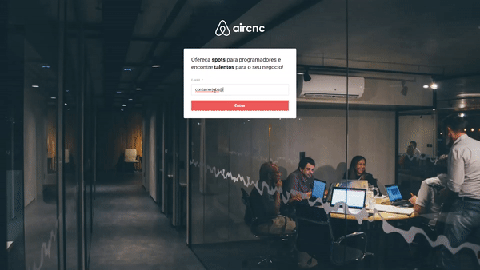

## Aircnc-ReactJs

<p align="center">

  

  	
  <a href="https://www.linkedin.com/in/daniel-silvado/">
    
  </a>
	
  
  <a href="https://github.com/DanielSilvado/ecoleta-frontend/commits/master">
    
  </a>

  
   <a href="https://github.com/DanielSilvado/ecoleta-frontend/stargazers">
    
  </a>
</p>

Aplicação desenvolvida na 9ª Semana Omnistack da <a href="https://rocketseat.com.br" target="_blank"> Rocketseat</a>.
Uma réplica do Aircnc para empresas.
A mesma consome dados da API <a href="https://github.com/DanielSilvado/Aircnc-NojeJs" target="_blank">Aircnc-NodeJs</a> 
e possui uma base de dados em MongoDB que armazena as informações dos Spots, com a empresa, tecnologias e valores da diária.
O frontend se comunica diretamento com o <a href="https://github.com/DanielSilvado/Aircnc-ReactNative" target="_blank">Mobile</a> onde os Devs podem se cadastrar e encontrar os Spots correspondentes as tecnologias com que trabalham.



# Tecnologias Utilizadas :

* ReactJs
* Axios
* React Router Dom
* React Hooks

# Instalação
Para funcionamento da aplicação é necessário utilizar a api <a href="https://github.com/DanielSilvado/aircnc-backend" target="_blank"> Backend Tindev </a>

**- Se estiver utilizando Yarn**
```
  Todos os comandos abaixo devem ser excutados na raiz do Projeto 
  Para instalar as dependências:
  yarn install   
  
  Para startar a aplicação :
  yarn start 
  
  Executa o aplicativo no modo de desenvolvimento.
  Abra http: // localhost: 3000 para visualizá-lo no navegador. 
   
```

**- Se estiver utilizando npm**
```
  Todos os comandos abaixo devem ser excutados na raiz do Projeto 
  Para instalar as dependências:
  npm install   
  
  Para startar a aplicação :
  npm start 
  
  Executa o aplicativo no modo de desenvolvimento.
  Abra http: // localhost: 3000 para visualizá-lo no navegador. 

```

## Licença

This project is licensed under the MIT License - see the [LICENSE.md](LICENSE.md) file for details
